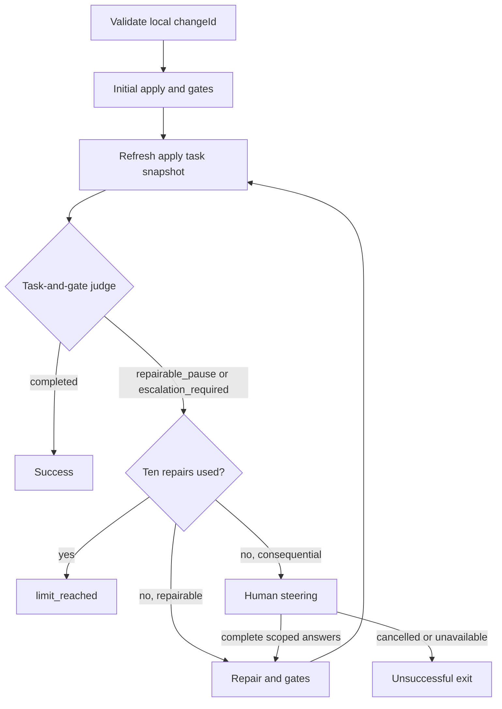

# Agent Mod

Extensions and prompt templates for the [Pi coding agent](https://github.com/badlogic/pi-mono).

Pi is a terminal coding agent. This package augments it with:

- **Guardrails** — a permission extension that intercepts shell commands and asks before running anything destructive (`git push`, `git rebase`, unknown `gh` calls, …), while auto-allowing safe read-only commands.
- **Usage visibility** — an ollama-usage extension that shows Ollama Cloud session and weekly usage in the status bar.

Install it once and every Pi session in the project gets permission prompts and Ollama Cloud usage in its status bar automatically.

## Requirements

- Pi `^0.99.1` (declared as a peer dependency in [`package.json`](./package.json)).

## Installation

```bash
pi install git:github.com/patextreme/agent-mod
```

This registers all extensions, prompts, and skills declared in [`package.json`](./package.json).

## Nix Packages

The flake also exposes [`pi-acp`](./nix/packages/pi-acp/README.md), an ACP stdio
adapter for Pi, ported from Ptah with its MCP-support patch:

```bash
nix build .#pi-acp
./result/bin/pi-acp
```

Pi must be installed separately and available on `PATH`, or selected with
`PI_ACP_PI_COMMAND`. This is a standalone Nix package, not part of `pi install`,
and is not added to the development shell. `nix flake check` builds it and runs
its upstream and patch tests.

## Contents

### Extensions

| Extension | Description |
|-----------|-------------|
| [Permission](./extensions/permission/index.ts) | Intercepts `bash` tool calls and applies regex-based permission rules; plays a bell on prompts and when the agent finishes; opt-in session-scoped `/permission-yolo` full bypass |
| [Ollama Usage](./extensions/ollama-usage/index.ts) | Shows Ollama Cloud session/weekly usage in the status bar; refreshes on ollama-cloud model selection and via `/ollama-usage-refresh` |

### Prompt Templates

| Prompt | Description |
|--------|-------------|
| [`commit-create-commit`](./prompts/commit-create-commit.md) | Create a git commit with an agreed-upon message |
| [`commit-create-commit-signoff`](./prompts/commit-create-commit-signoff.md) | Create a git commit with DCO sign-off |
| [`commit-generate-message`](./prompts/commit-generate-message.md) | Generate a commit message from staged changes |
| [`commit-generate-message-conventional`](./prompts/commit-generate-message-conventional.md) | Generate a conventional commit message |
| [`init`](./prompts/init.md) | Create or update `AGENTS.md` for a repository |
| [`review`](./prompts/review.md) | Review code changes and provide actionable feedback |

### Skills

| Skill | Description |
|-------|-------------|
| [`acpx-flow`](./skills/acpx-flow/SKILL.md) | Create, modify, and debug acpx flows using the official capability documentation |
| [`openspec-review`](./skills/openspec-review/SKILL.md) | Review an OpenSpec change for semantic soundness before implementation |

## Permission Extension

Intercepts every `bash` tool call and applies regex-based permission rules in **forward order** — the first matching rule wins.

**Actions:**
- `allow` — proceed without prompting
- `ask` — prompt the user for confirmation (with a "Always allow" option)
- `deny` — block immediately with a reason

**Built-in rules** (see [`rules.ts`](./extensions/permission/rules.ts) for the exact regexes):
- `git push`, `git rebase` — ask
- Read-only `gh` subcommands — allow: `gh search`, `gh repo view/list`, `gh issue view/list`, `gh pr view/list/checks/diff`, `gh release view/list`, `gh workflow view/list`, `gh run view/list/watch`
- `gh api` GET requests — allow, both explicit (`--method GET` / `-X GET`) and implicit (no `--method`/`-X` and no body-adding flags `-f`/`-F`/`--field`/`--raw-field`)
- Any other `gh ...` command — ask
- Commands that match **no** rule: ask outside a sandbox, auto-allow when `PI_SANDBOX=true`

There is no explicit `git commit` rule; commits fall through to the unmatched-command path (ask outside sandbox).

**Commands:**
- `/permission-list-always-allow` — show all patterns the user chose "Always allow" for
- `/permission-reset` — clear all "Always allow" choices and disable YOLO mode

The always-allow state resets on each new session.

**YOLO mode:**
- `/permission-yolo` — toggle session-scoped YOLO mode. Bare invocation toggles; `on`/`off` set it explicitly. While on, **every** `bash` command is allowed without consulting rules or prompting — including `ask`/`deny` rules and the no-match prompt.
- A persistent yellow `⚠️ YOLO MODE ON` warning shows in the status bar while enabled.
- YOLO mode is a deliberate, explicit opt-in: the typed command itself is the confirmation (no dialog). It resets to off on each new session, and `/permission-reset` also disables it.
- `--yolo` — CLI flag pinning YOLO mode on for the entire process run, including headless runs (`-p`, `--mode json`). The pin survives `session_start` and `/permission-reset` and cannot be turned off mid-session; `/permission-yolo off` while pinned reports that the mode is pinned instead of disabling it.

A bell (`extensions/permission/sounds/message.oga`, played via `pw-play`) rings on each permission prompt and when the agent finishes a run (suppressed if you aborted it), so you don't have to watch the screen.

## Ollama Usage Extension

Shows Ollama Cloud session and weekly usage in the pi status bar as `ollama: 2.6% / 0.8%` (session / weekly).

- Polls ollama.com's undocumented `GET /api/usage` endpoint (the one backing the ollama.com dashboard). It may change or disappear without notice.
- Refreshes whenever an ollama-cloud model is selected — `/model`, Ctrl+P cycling, and session restore — and via `/ollama-usage-refresh`.
- Switching to a non-ollama-cloud model clears the slot.
- Reuses pi's resolved ollama-cloud provider key, so no separate configuration is needed beyond the existing ollama-cloud entry in `models.json`.
- Failure paths are non-throwing: a failed fetch renders the dim placeholder `ollama: ? / ?`, and a missing provider key silently clears the slot.

## OpenSpec grooming flow

[`flows/openspec-groom/index.ts`](./flows/openspec-groom/index.ts) grooms an **existing active local** change. From this checkout (after `npm install`):

```bash
acpx flow run ./flows/openspec-groom/index.ts --input-json '{"changeId":"example-change"}'
```

From another local workspace, pass the absolute flow path. Only `changeId` is accepted; archived, missing, store-backed, symlinked, and escaping targets are rejected before edits. OpenSpec must provide `list` and `status --json` with schema-resolved `existingOutputPaths`. The flow runs targeted `openspec validate <id> --type change --strict --json --no-interactive` before review and after each update. Invalid artifacts enter repair; command/JSON failures terminate without retries. Repairs can revise only existing schema planning artifacts, never create missing ones.

### Prerequisites and skill discovery

Requires acpx **0.19.4**, OpenSpec, authenticated Pi, and a working `pi-acp` adapter. Configure acpx's `pi` profile (not just its default agent) in `~/.acpx/config.json`, for example `{"agents":{"pi":{"argv":["pi-acp"]}}}`. Every agent/decision invocation uses an isolated new Pi session, including repeated graph visits. Agent timeouts remain acpx defaults; do not set a global timeout shorter than the intended steering wait.

Pi ACP passes prompts to Pi's RPC skill expansion. Review uses `/skill:openspec-review <id>` with **only the change ID** as run-specific input. Updates instead receive a standalone flow-owned prompt from [`flows/openspec-groom/helpers.ts`](./flows/openspec-groom/helpers.ts), with current-cycle assessed structural/Critical resolutions, complete steering, and the resolved existing-artifact allowlist. It authorizes those planning repairs together without per-artifact confirmations, never invokes the built-in update skill, and stops on invalid scope, missing artifacts, or newly discovered consequential decisions. The generated `openspec-update-change` skill remains unchanged; ordinary invocations still require confirmation for every artifact revision.

Ensure the review skill is discovered. To avoid a same-named global/package skill shadowing it, optionally pin only the review skill in the Pi process used by the adapter. For example create an executable wrapper outside the target change, substituting absolute paths:

```sh
#!/bin/sh
exec /absolute/path/to/pi --no-skills \
  --skill /absolute/path/to/agent-mod/skills/openspec-review/SKILL.md "$@"
```

Set `PI_ACP_PI_COMMAND=/absolute/path/to/wrapper` when running the flow (supported by pi-acp 0.0.34). Verify Pi's loaded-skill diagnostics with that wrapper before use. Without a wrapper, ensure the review skill is trusted/discovered and no same-named skill wins discovery. No update-skill discovery or pinning is required. Model-free tests exercise native review-skill expansion, direct updater prompt passthrough with complete multiline authorization, and unchanged ordinary update confirmations. Fake-agent tests additionally check flow routing and fresh sessions; neither test suite proves a live model will obey the policy.

**Tool permissions are separate.** Configure acpx/adapter and Pi permission-extension approvals explicitly for the intended read/edit commands; flow authorization does not approve tools, bypass deny rules, or enable YOLO. Unattended updates need an appropriate separately configured permission policy. If you require no provider retries either, disable Pi's `retry.enabled` separately; the flow itself never retries failed phases.

### Completion, steering, and outcomes

Success means strict structural validation passes and a conclusive review has **no Critical findings**. Major findings, blockers, and readiness labels alone do not trigger repairs or prevent success; grooming success is **not implementation readiness**. An outstanding Major product/architecture decision can therefore remain after success and does not independently reach human steering. An unresolved decision in the change is not an inconclusive review when its uncertainty and severity are conclusively reported; unusable output or indeterminate Critical severity still fails. Assessments may conclusively identify the decision requiring steering without choosing its answer. They escalate architectural, design, product, high-stakes, and materially different alternatives only within structural repairs or Critical findings; neither assessment nor updater may promote Major issues just to obtain repair authority.

The review skill uses consequence-based severity and bounded, read-only investigation of load-bearing claims, not exhaustive documentation perfection. Archive-preventing delta defects and credible specification loss remain Critical. Repository-owned paired semantic fixtures and a bounded old/new live-model procedure are in [`tests/semantic/openspec-review/`](./tests/semantic/openspec-review/README.md); these complement, rather than replace, deterministic plumbing tests.

When any issue needs steering, stdin and stderr must be TTYs. The flow displays every escalated issue and recommendation and requires a nonblank answer for each before dispatching one coordinated update (including autonomous fixes). Steering has a **seven-day** deadline, supports cancellation, and closes readline on every exit. EOF or no terminal returns `needs_human`; timeout returns `failed` with its reason. No ACP phase runs while steering reads input.

There are at most **ten updater dispatches**, shared by structural and semantic repairs. Failed updates count, stop immediately, and may leave partial edits. Validation and review still run after update ten, so final convergence can succeed. Repeated Critical findings consume the same budget without a separate early-stop heuristic.

The flow emits one structured result and a concise stderr summary. Examples (the `remaining` field contains the current review/errors):

```json
{"changeId":"example-change","outcome":"success","updateAttempts":2,"summary":"Validation passes; no Critical findings. This is not implementation readiness.","remaining":"Major findings remain..."}
{"changeId":"example-change","outcome":"limit_reached","updateAttempts":10,"summary":"Ten update attempts consumed; unresolved errors or Critical findings remain.","remaining":"Critical findings remain..."}
```

Only `success` exits zero. Other outcomes are `limit_reached`, `needs_human`, `cancelled`, and `failed` (including inconclusive review/assessment, missing artifacts, malformed output, and agent/command errors). Failure routes throw after emitting their result so acpx really exits nonzero. Process-wide termination can interrupt output; acpx's persisted run state remains the diagnostic source.

acpx retains run history and transcripts under `~/.acpx/flows/runs/`. There are **no additional report files, commits, stashes, rollback, or resume/checkpoint support**. Existing dirty artifacts are the starting state; earlier edits are preserved on failure. Restarting explicitly starts a new flow and budget. The allowlist and authorization constrain prompts, not an OS sandbox; use separate isolation if needed.

## OpenSpec implementation flow

[`flows/openspec-implement/index.ts`](./flows/openspec-implement/index.ts) implements an approved **active repo-local** change:

```bash
acpx flow run ./flows/openspec-implement/index.ts --input-json '{"changeId":"example-change"}'
```

From another workspace use the absolute entrypoint path. Only `changeId` is accepted; invalid, archived, missing, store-backed, symlinked and escaping targets are rejected before implementation. Use the same acpx/Pi/adapter prerequisites and explicit `pi` profile described above, with the `openspec-apply-change` skill discovered in the adapter's Pi process. Every apply, repair, assessment and decision invocation gets a fresh isolated session at the selected workspace. This is session isolation, not filesystem isolation.



### Implementer contract

Apply and repair explicitly select the change, read current status/apply instructions and every context file, preserve CLI-controlled blocked/ready/all-done state, and honor project context and compatible guidance. A blocked state is not permission to create missing planning artifacts. The implementer attempts all remaining tasks. Multiple substantive groups are delegated with task identities, scoped ownership and dependencies; only independent groups run concurrently. A trivial single substantive group need not delegate. The parent owns checklist consolidation, marks completed work promptly, waits for all delegates, and runs final applicable gates after consolidation.

The implementer returns a JSON report with `summary`, `completedTasks`, `remainingTasks`, `blockers`, `gates`, `noApplicableGates`, and `delegatedGroups`. Each blocker includes unique `id`, `issue`, `recommendation`, boolean `escalation`, and requested authorization `scope`. Each gate includes its concrete `command`, integer `exitCode`, boolean `afterEdits`, and numeric `attempt` (initial apply is 0). `delegatedGroups` records task IDs, ownership and results. Empty arrays are allowed; `noApplicableGates` is normally null and otherwise must explain why the current edit scope has no applicable project gates.

Success requires a refreshed task snapshot showing every task complete, no remaining work/blockers, and applicable current gates passing **after the last relevant edit** on the current attempt. Initially complete checkboxes still require gates. Repairs can correct code and rerun gates even if checkboxes already read done. Missing, stale or failing evidence cannot support completion; malformed reports fail rather than authorize unsafe steering. The read-only three-choice judge uses the snapshot, report, current project instructions and scope to assess gate applicability. Deterministic checks reject unsupported completion claims. Reported evidence is not independent execution proof: success means **task-and-gate completion only**, not an independent implementation verification review or readiness to archive. The flow does not invoke the verify skill.

### Repairs, authority and exits

An initial apply does not consume the budget. Up to **ten repair dispatches** are allowed, including failed dispatches. Each normal return refreshes tasks and is judged, including repair ten: it may succeed; either pause category after that exits `limit_reached`, without collecting more steering or dispatching repair eleven. Normal test failures/blocker reports are judge inputs. Invocation errors, timeouts, command failures and unusable decision results terminate without silent invocation retries.

Repairs within approved design can proceed autonomously. Ambiguity, design changes, destructive actions and missing external access require human guidance; mixed blockers escalate before any further repair. The outer flow owns interaction: inner agents return pauses rather than waiting for a human. Validated issues show recommendations and requested scope. Scoped answers accumulate with their associated issues across fresh repair sessions. Plan edits require an answer explicitly authorizing those plan edits; consent never expands to unrelated/destructive actions or access. stdin and stderr must be TTYs for steering; the shared seven-day deadline and cancellation rules apply. No terminal/EOF returns `needs_human`; cancellation returns `cancelled`; malformed steering and timeout return `failed`.

Tool permissions remain separate: flow prompts do not approve tools, bypass deny rules or enable YOLO, and are not an OS sandbox. Apply and repair invocations use 90-minute timeouts; assessment and judge invocations retain acpx defaults. Do not set a global timeout shorter than the desired steering wait. Provider retry settings are separately controlled by Pi.

Terminal results contain `changeId`, `outcome`, `repairAttempts`, `summary`, and `remaining` tasks/blockers, plus a concise stderr line. Only `success` exits zero; `limit_reached`, `needs_human`, `cancelled`, and `failed` deliberately exit nonzero after reporting. acpx retains transcripts/run history; no additional report files, automatic commits, stashes, archive, rollback or resume are performed. Existing working-tree edits are preserved even on failure. An explicit restart uses the current tree and a fresh zero-repair budget, not a prior-run checkpoint.

## OpenSpec verification flow

[`flows/openspec-verify/index.ts`](./flows/openspec-verify/index.ts) independently verifies an explicitly selected, **completed active repo-local** change and performs bounded repairs:

```bash
acpx flow run ./flows/openspec-verify/index.ts --input-json '{"changeId":"example-change"}'
```

From another local workspace, use the absolute entrypoint path. Only `changeId` is accepted; archived, missing, store-backed, symlinked and escaping targets are rejected. The initial refreshed OpenSpec apply snapshot must be unblocked with usable tasks and every task complete; incomplete-entry diagnostics direct the caller to `openspec-implement`, not to verifier repair. Requires the same acpx **0.19.4**, OpenSpec, authenticated Pi and `pi-acp` prerequisites and explicit acpx `pi` profile described above.

### Native verification skill and isolation

The verifier invokes the existing [`openspec-verify-change`](./.pi/skills/openspec-verify-change/SKILL.md) skill through Pi's native `/skill:openspec-verify-change <id>` expansion, followed by flow-owned read-only policy and current context. The generated skill itself is unchanged, including its ordinary warning-tolerant archive wording; the flow applies its own stricter acceptance contract. Pin this checkout's skill in the adapter's Pi process so a same-named global/package skill cannot shadow it. Create an executable wrapper outside the target change, substituting absolute paths:

```sh
#!/bin/sh
exec /absolute/path/to/pi --no-skills \
  --skill /absolute/path/to/agent-mod/.pi/skills/openspec-verify-change/SKILL.md "$@"
```

Set `PI_ACP_PI_COMMAND=/absolute/path/to/wrapper` when running the flow (supported by pi-acp 0.0.34), and inspect the wrapper's loaded-skill diagnostics before use. `--no-skills` excludes default discovery while the explicit absolute `--skill` loads the intended file even in another workspace. No apply/update skill is needed for the flow-owned repair prompt. Model-free native-expansion tests in [`flows/openspec-verify/skill-expansion.test.ts`](./flows/openspec-verify/skill-expansion.test.ts) exercise the absolute pin against a same-name global collision and preserve the full flow policy/context and ordinary skill behavior; they do not prove model obedience.

Every verifier, classifier, assessor and repair invocation gets a **fresh session** in the selected workspace, including repeated cycles. Verifier, classifier and assessor are read-only; only the scoped repair agent may edit. Read-only policy and repair authorization are **prompt-level constraints, not OS isolation**. Tool permissions are separate: configure acpx/adapter and Pi permissions explicitly; these prompts do not approve tools, bypass deny rules or enable YOLO. Use separate filesystem/process isolation if required. Verifier and repair invocations use 90-minute timeouts; classifier and assessor invocations retain acpx defaults. Do not impose a global timeout shorter than the intended steering wait. Pi provider retry settings are separately controlled.

### Acceptance, repairs and outcomes

Success requires a **conclusive verification with no Critical or Warning findings and no missing verification evidence**, plus a refreshed completed task snapshot. Suggestions are allowed and do not trigger repairs. Genuinely schema/scope-inapplicable checks need explicit justification; required checks cannot be skipped or waived by steering. An archive-ready label, complete checkboxes alone or absence of an explicit issue list cannot substitute for current applicable gate and verification evidence. Unusable/inconclusive verification or classification fails rather than silently accepting the change.

The read-only classifier is a constrained decision node choosing `accepted`, `blocking` or `inconclusive`; deterministic guards reject unsupported acceptance. It does not plan repairs. A separate read-only ACP assessor prepares validated resolutions covering every current Critical/Warning finding, with finding IDs, repository paths, recommendations, intended scope and escalation reasons. Repairs within the approved design may proceed autonomously; ambiguous requirements, design changes, destructive actions and missing external access require scoped human steering. **All consequential issues in a mixed batch must receive steering before any repair is dispatched**, including the autonomous fixes in that batch. The outer flow owns interaction; inner agents return issues instead of waiting for user input. Planning edits need explicit scoped authorization, and answers never authorize unrelated/destructive actions or external access. stdin and stderr must be TTYs; the shared seven-day steering deadline and cancellation rules apply. No terminal/EOF yields `needs_human`; cancellation yields `cancelled`; timeout or malformed steering yields `failed`.

There are at most **ten repair dispatches**, including failed dispatches. Invocation failures terminate without silent flow retries and may leave partial edits. After every normally returned repair, tasks are refreshed and a fresh verifier/classifier runs, **including repair ten**: convergence can still succeed, but unresolved findings then yield `limit_reached` without repair eleven or more steering.

The flow emits one structured terminal result containing `changeId`, `outcome`, `repairAttempts`, `summary`, `remaining` findings and the full verification `report`, plus a concise stderr summary. Outcomes are `success`, `limit_reached`, `needs_human`, `cancelled` and `failed` (including invalid/incomplete targets, malformed output, inconclusive evidence and agent/command errors). **Only `success` exits zero**; other outcomes report their result and deliberately fail so acpx exits nonzero. Orderly acpx interruption (SIGINT) is observed on the active phase's abort signal: it emits `cancelled` once and includes an interrupted repair in the dispatch count, even when the runner bypasses graph routing. Forced process termination can prevent output; acpx retains run history/transcripts under `~/.acpx/flows/runs/`.

Existing dirty edits are the starting state and are preserved, including on failure. The flow never syncs specs, archives, commits, stashes or rolls back, and writes **no extra report file**. There is no resume/checkpoint support; an explicit restart uses the current working tree and a fresh repair budget. Verification success is not an automatic archive action.

## OpenSpec finalization flow

[`flows/openspec-finalize/index.ts`](./flows/openspec-finalize/index.ts) finalizes an **already-verified active repo-local** change:

```bash
acpx flow run ./flows/openspec-finalize/index.ts --input-json '{"changeId":"example-change"}'
```

From another local workspace, use the absolute entrypoint path; the invocation directory selects the workspace. Only `changeId` is accepted. Missing, archived, store-backed, symlinked, escaping targets and unsupported input fields are rejected before writes. Scope is rechecked before archival.

**Standalone invocation asserts prior implementation verification.** It does not require saved verification evidence, invoke `openspec-verify`, rerun implementation gates, judge task completion, or repair code/planning artifacts. Success means synchronization acceptance (or no applicable deltas) and confirmed archival, not implementation verification. If verification has not passed, use the verification flow first or the full pipeline below.

### Unattended synchronization and acceptance

The lifecycle is `preflight → prepare → sync → independent sync assessment → archive`. Invocation authorizes these operations without workflow confirmations, human steering, or repair/reassessment loops. Ambiguity stops finalization rather than requesting input. The ordinary generated sync/archive skills are unchanged and are not invoked by this flow.

Use the same acpx **0.19.4**, OpenSpec, authenticated Pi, `pi-acp`, and explicitly configured acpx `pi` profile described above. Sync and assessment use fresh isolated Pi sessions in the selected workspace, each with a 90-minute timeout. No sync/archive skill discovery is needed: both prompts are flow-owned. **Tool permissions must already permit unattended execution**: configure acpx/adapter and Pi permission policy for the intended tools. Invocation does not approve tools, bypass deny rules, or enable YOLO. The selected-main-spec allowlist and read-only assessor policy are **prompt-level scope, not OS isolation**; fresh-session isolation is not filesystem isolation. Use separate isolation if required. Pi provider retries remain separately controlled.

Every delta in status's `artifactPaths.specs.existingOutputPaths` is selected, including nested capabilities. Corresponding main specs live under the validated local `openspec/specs/` root. Existing ancestors, deltas and destinations must be safe non-symlink paths. Before writing, one valid `openspec instructions specs --change <id> --json` snapshot supplies applicable spec-content rules; command failure or malformed JSON stops before writes. Omitted rules mean no configured rules. Rules cannot expand paths, authorization or workflow. Original main-spec contents or absence are captured in memory, including dirty baseline edits.

Synchronization is a **semantic merge**, not whole-requirement replacement: ADDED, partial MODIFIED, REMOVED and RENAMED effects preserve unaffected requirements/scenarios and existing Purpose text. New capabilities use delta Purpose text or a reported TBD placeholder and main-spec format, not delta-operation headers. Already-applied effects, including already-removed/renamed requirements, are idempotent no-ops. Explicit capability-retirement metadata is considered; an empty result alone does not authorize retirement.

A separate fresh **read-only sync assessor** receives all deltas, the original baseline, current main specs and content rules, without the worker transcript. This is synchronization assessment, **not implementation verification**. Worker success alone cannot authorize archival: a conclusive `accepted` report must cover every capability and operation with intended-effect, Purpose/structure, preservation, rules and retirement evidence. `mismatch`, `inconclusive`, malformed reports, missing/duplicate/extra coverage, invocation errors and unsupported acceptance block archival without repairs or retries. Scope, selection and content fingerprints are refreshed before the move; changed inputs invalidate acceptance rather than trigger automatic reassessment.

If status resolves **no delta specs**, including specs-skipped changes, sync and assessment are `not_applicable`; there is no specs-instruction lookup or main-spec write, and archive may proceed.

### Move-only archival, partial results and recovery

Archival performs no second sync and moves the **whole change directory**, including `.openspec.yaml` and all planning artifacts, into the validated planning home's `changesDir/archive/`. The destination is `YYYY-MM-DD-<changeId>` using the current UTC date; an existing `YYYY-MM-DD-` prefix is preserved, not doubled. Any existing destination entry—file, directory or dangling symlink—is a collision: no overwrite, merge, automatic alternate name or inferred success. Symlinked/escaping archive ancestors are rejected.

Treat finalization as an **exclusive operation**: do not concurrently edit the selected change/main specs or write the archive destination. The flow guards its own move and rechecks inputs/destination, but does not provide a concurrent-writer transaction or atomic multi-file synchronization. Archived success requires confirmed source absence and destination presence. A move followed by failed confirmation is `moved_unconfirmed`, not success or a guarantee that the change is still active; inspect both locations before recovery.

On normal terminal routing, finalization emits one flow-owned JSON result and a concise stderr summary. Fields include `changeId`, `outcome`, `summary`, `phase`, `failedPhase`, `phases`, `sync`, `assessment`, `remaining` issues and `archive` (`destination`, `state`). Phase states are `not_started`, `completed`, `failed` or `not_applicable`; archive states are `not_started`, `moving`, `failed`, `moved_unconfirmed` or `archived`. A completed sync-worker phase is not itself accepted synchronization: consult `assessment`. Only `success` exits zero; `failed` and `cancelled` exit nonzero. acpx may additionally emit its own CLI run envelope; it is not the flow-owned result. Cancellation output has the bounded limits below.

Failure preserves existing and partial edits. A worker that edits one main spec then fails leaves those edits and blocks assessment/archive. Rejected assessment leaves main-spec edits but blocks the move. Archive failure after accepted synchronization preserves that acceptance in the result and does not revert specs. A pre-move failure leaves the active change; an unconfirmed move needs filesystem inspection, not that assumption.

An explicit standalone rerun resolves the **current active tree afresh**, completes remaining sync effects and independently reassesses even already-applied changes before retrying archival. It does not trust previous evidence/transcripts or resume a checkpoint. Resolve the reported ambiguity, unsafe input or collision first. Already-archived targets are rejected, not treated as successful restarts. There is no automatic Git management: no commits, stashes, reset, rollback, separate report files or persistent resume/checkpoints.

## OpenSpec full pipeline

[`flows/openspec-all/index.ts`](./flows/openspec-all/index.ts) runs the same explicitly selected active local change through all four stages:

```bash
acpx flow run ./flows/openspec-all/index.ts --input-json '{"changeId":"example-change"}'
```

From another workspace use the absolute entrypoint path. Only `changeId` is accepted, with the same unsupported-input/local-target rejection before writes. Every stage keeps the same change and canonical workspace. Unlike standalone finalization's caller-asserted readiness, this pipeline reaches finalization only after its verification stage succeeds.

### Native composition and transparent steering

This is **one single native acpx graph**, in `groom → implement → verify → finalize` order, not shell chaining, constituent CLI subprocesses or nested runners. A stage-scoping adapter namespaces nodes/edges and projects callback outputs, results, step history and node identifiers back to each constituent's local view. Existing acceptance policies, authorized edit scopes, fresh sessions, per-node timeouts, acpx `pi` profile and supported active-attempt abort signals are preserved. Groom's ten updater dispatches, implement's ten repairs and verify's ten repairs remain **independent budgets**; implementation repairs never consume verification's budget. Internal repairs follow constituent policies, not a new pipeline policy. All existing standalone entrypoints remain available and unchanged.

Each transition requires a validated captured `success` result for the same change/workspace. Missing, malformed, contradictory or unsuccessful results and unexpected execution errors stop later dispatch. Implementation success remains task-and-gate completion only; verification still requires conclusive no-Critical/no-Warning acceptance with required evidence. Finalization then performs its independent sync assessment once, **without duplicate implementation verification**. No-delta finalization retains its standalone behavior. There are **no stage-transition prompts**; finalization itself is unattended.

Use the shared prerequisites and configure skill discovery for **all three** existing native skills: `openspec-review`, `openspec-apply-change` and `openspec-verify-change`. A `--no-skills` wrapper pinning only review or only verification is insufficient for the pipeline; if pinning, include all three trusted absolute skill paths in the adapter's Pi process and inspect loaded-skill diagnostics. Ordinary generated skills retain their behavior. Tool permissions remain separately configured; composition neither expands scope nor provides OS isolation. Do not impose a global timeout shorter than the intended steering wait.

Only constituent terminal emitters are captured, **not the entire stderr stream**. Stage-labelled stderr progress and grooming/implementation/verification steering remain visible on the invocation terminal, including issues, recommendations and scoped questions. Answers reach the originating stage's existing logic. stdin and stderr must be **TTYs**; the **seven-day** steering deadline, cancellation semantics and **complete-answer** authorization rules are retained. Incomplete answers cannot authorize that cycle's edits. Required verification evidence cannot be waived by steering. If steering is unavailable or EOF prevents complete input, `needs_human` stops the pipeline with later stages `not_started`; timeout/malformed input fails as in the originating stage. Nothing silently supplies answers or broadens edit authorization.

### Aggregate outcome and restart

On normal terminal routing there is one **aggregate flow-owned JSON result**, not duplicate constituent terminal JSON. It records `changeId`, canonical `workspace`, overall `outcome`, `summary`, `activeStage`, `failedStage`, ordered `stages` entries (`stage`, `status`, retained child `result`), and known `finalization`/`archive` state. An unsuccessful stage preserves its `limit_reached`, `needs_human`, `cancelled` or `failed` outcome; later stages are explicitly `not_started`. Only success of **all four stages** exits zero. Progress/steering remain separate on stderr. acpx may additionally emit its **CLI run envelope**; do not confuse that runtime output with the aggregate result or assume stdout contains only one JSON object. Cancellation output has the bounded limits below.

No unsuccessful stage is automatically retried/restarted, and no edits are rolled back. A full-pipeline restart begins again at **groom** against the current active tree with fresh stage-local budgets, not at the previously failed stage and not by skipping stages using an earlier report. Use the existing standalone groom/implement/verify/finalize entrypoints for intentional later-stage recovery; standalone finalization still asserts prior verification. Already-archived targets are invalid. Neither new entrypoint performs automatic Git management or writes separate report/checkpoint files.

### Bounded cancellation reporting for both new flows

Both `openspec-finalize` and `openspec-all` attempt **best-effort cancellation emission at most once**, shared with normal terminal emission, only where cancellation is observed through supported **active attempt-scoped abort signals**. Listeners are installed in supported callback contexts, check already-aborted signals and are cleaned up when their scope ends. Observed cancellation—including routing bypass after listener installation—uses only recorded progress, preserves edits and prevents later dispatch. It never fabricates an absent child result, marks an interrupted phase/stage complete or claims unconfirmed archival.

This is **not an exactly-once delivery guarantee**, a public parent-run signal, or whole-invocation cancellation coverage. During **callback gaps**, **node-start persistence**, or **routing bypass before listener installation**, flow-owned JSON and its stderr summary **may be absent**. Forced termination can likewise prevent reporting. The diagnostic fallback is **acpx persisted run history/transcripts** under `~/.acpx/flows/runs/`, not separate flow report files. Inspect current specs and both archive/source paths as needed; missing output does not prove that no writes or move occurred. These limits retain installed acpx and the single native graph architecture, without a runtime/dependency change or a parent-run cancellation bridge.

## Development

```bash
npm install            # install deps
npm run format         # biome format --write .
npm run lint           # biome lint .
npm run check          # biome check . (lint + format check combined)
npm run typecheck      # tsc --noEmit
npm test               # tsx --test (extensions, docs, and flow suites)
nix flake check        # nix build checks (biome, tsc, tests, package builds)
```

Requires `biome`, `node`, and `typescript` in PATH. Use `nix develop` (provides all tooling) or install globally.

Before committing changes that touch `package*.json` or `nix/`, also run `nix flake check` — it mirrors the JS checks and catches stale `npmDepsHash` values after dependency changes.

## License

MIT — see [LICENSE](./LICENSE).