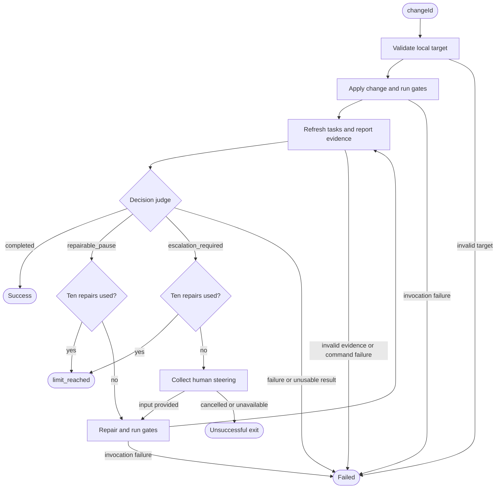

# Design

## Context

See proposal.md for motivation and specs/openspec-implement/spec.md for the behavior contract. The installed acpx API provides ACP, decision, compute, and action nodes. Groom already demonstrates fresh sessions, guarded routing, bounded dispatch counting, structured terminal reporting, and terminal human steering. Its artifact-only edit allowlist is not suitable for code implementation.

## Goals / Non-Goals

**Goals:**
- Make implementation and steering boundaries testable through dependency-injected commands, steering, and result emission.
- Separate model classification from deterministic target, budget, and terminal handling.
- Establish a directory structure that supports a second flow without a generic framework.

**Non-Goals:**
- Independent verification, code-review findings, or readiness to archive.
- Automatic commits, rollback, resume/checkpoints, background monitoring, or dependency upgrades.
- Changes to groom's review, authorization, or iteration semantics.

## Decisions

### 1. Per-flow directories and explicit entrypoints

Use:

```text
flows/
  openspec-groom/
    index.ts
    flow.ts
    helpers.ts
    helpers.test.ts
    integration.test.ts
  openspec-implement/
    index.ts
    flow.ts
    helpers.ts
    helpers.test.ts
    integration.test.ts
  shared/
    steering.ts
    steering.test.ts
    skill-expansion.test.ts
    fixtures/
      fake-agent.mjs
```

`index.ts` exports the default runnable definition; factories and graph composition live in `flow.ts`. Names of additional focused modules can follow their responsibility. Move existing tests alongside their owning flow. Extract local-target and command helpers into shared modules only where both flows actually need them, retaining flow-specific authorization in groom. Do not copy groom's planning-artifact allowlist into implementation.

Alternative: root-level `.flow.ts` wrappers preserve invocation paths, but the agreed structure prioritizes clear per-flow ownership and accepts a documented path migration. `.flow.ts` is a convention, not a requirement.

### 2. Initial apply and repair are ACP nodes; judge is a decision node

Each agent invocation uses the configured `pi` profile in a fresh isolated session at the selected repository cwd. Initial apply explicitly invokes the apply skill with `changeId`, plus flow instructions requiring delegation and a useful final report. Repair invokes the same apply behavior with prior report, current task state, repair guidance, and accumulated relevant human authorization. It can correct implementation and rerun gates even when task checkboxes already read complete.

Require reports to identify completed and remaining tasks, blockers with recommendations, applicable gate commands and results, and delegated group results. Preserve summary prose; use a validated supporting report envelope where needed for safe steering. Validate any report data used to collect human input before presenting it.

After each normal implementer return, refresh `openspec instructions apply --change <id> --json` to obtain current task state. Supply that snapshot, the latest report, and gate evidence to a read-only decision node with exactly `completed`, `repairable_pause`, and `escalation_required`. Missing or stale gate evidence cannot support completion. Gates must be run after relevant edits; edits during repair invalidate earlier gate results. If all tasks initially read done, the implementer still establishes gate evidence.

The judge does not inspect implementation correctness independently or invoke the verify skill. Use deterministic consistency checks to reject a completed decision if CLI tasks remain or the report lacks applicable passing gates. Gate applicability comes from current project instructions and the scope of edits; an empty set requires an explicit justification. Classification remains model-based, not an OS-enforced correctness guarantee.

Alternative: a verification agent conflates completion with the planned future verification flow. A prose-only judge lacks the constrained routing provided by acpx decisions.

### 3. Delegate at substantive task-group boundaries

The implementer attempts all remaining tasks rather than stopping after a fixed task batch. Multiple substantive groups make the scope non-trivial and require subagent delegation. Each delegate receives task identities, approved context, ownership boundaries, dependencies, and reporting expectations. Independent groups may run concurrently; dependent groups run sequentially. Avoid concurrent writes to shared task checklists: the parent consolidates delegate completion and updates checkboxes promptly as groups return. The parent waits for all dispatched work before reporting and runs the final applicable gates after consolidation.

This is implementer behavior, not a nested acpx graph per task group. Task grouping is semantic and should not be equated with every heading or checkbox. A trivial single-group change need not delegate.

### 4. Escalate consequential decisions before repair

A pause is repairable only within the approved design and existing authorization. Ambiguity, design changes, destructive actions, and missing external access require steering. Mixed repairable and consequential blockers route to escalation before any further repair.

On escalation, prepare a validated read-only issue packet from the report, with unique identifiers, blockers, recommendations, and requested authorization scope. If the report cannot supply a usable packet, a fresh read-only assessment invocation may prepare it; failures terminate rather than guessing. Reuse terminal steering, including its existing deadline and cancellation/unavailable-input behavior. Keep explicit human answers associated with their issues across subsequent fresh sessions, but do not expand their scope or treat permission to edit a plan as permission to perform destructive operations.

The apply skill's normal interactive pause becomes a final blocker report; the outer flow owns human interaction. Missing planning artifacts remain blocked until explicit steering authorizes their creation or other resolution. Flow instructions do not bypass CLI state or tool permissions.

### 5. Count repair dispatches, then judge before enforcing the limit

Count dispatched `repair` steps from run state, including failed dispatches. Initial apply does not consume the ten-repair budget. Every normal apply/repair return goes to judge. A completed decision exits immediately. A pause checks budget first: after ten repairs exit `limit_reached`, otherwise dispatch repair or collect steering as appropriate. A failed tenth invocation exits failed, not limit_reached; only a normal result reaches judgment.

Invocation failure, timeout, cancellation, and invalid output are guarded before output routing. There are no automatic infrastructure retries. Ordinary test failures and implementation blockers contained in a normal report are judgment inputs, not invocation failures.



### 6. Reuse terminal outcome conventions

Emit changeId, outcome (`success`, `limit_reached`, `needs_human`, `cancelled`, or `failed`), repairAttempts, summary, and remaining tasks/blockers, plus a concise human-readable line. Unsuccessful routes deliberately cause a nonzero CLI exit after emitting their result. Success means task-and-gate completion only. Existing working-tree edits are the starting state, not grounds for a reset.

## Risks / Trade-offs

- [Judge trusts reported gate evidence] → Require concrete current commands/results and fresh task snapshots; clearly disclaim independent verification.
- [Delegates conflict on shared files] → Require ownership boundaries, parent-owned checklist consolidation, and sequential dependent groups.
- [Fresh sessions lose authorization context] → Carry relevant steering and prior reports explicitly in repair prompts.
- [Prompt-level authorization is mistaken for sandboxing] → Document limits and retain existing permission controls.
- [Test relocation hides coverage] → Update JS and Nix test discovery and assert migrated groom integration tests still run.
- [Existing in-flight groom artifacts mention old paths] → Document migration in this change rather than silently rewriting the other change's historical plan.

## Migration Plan

1. Move groom and shared files; update imports, fixture paths, test discovery, README, and repository layout guidance. Preserve groom behavior and run its full suite at the new entrypoint.
2. Add implement helpers, graph, unit tests, and real-runner integration tests using fake agents.
3. Document new invocation and outcomes; run formatting, lint, typecheck, tests, and `nix flake check` because package/Nix test configuration changes.

No compatibility wrapper is planned for the old groom path. Reverting the code migration restores that invocation; runtime failures never roll back user implementation edits.
