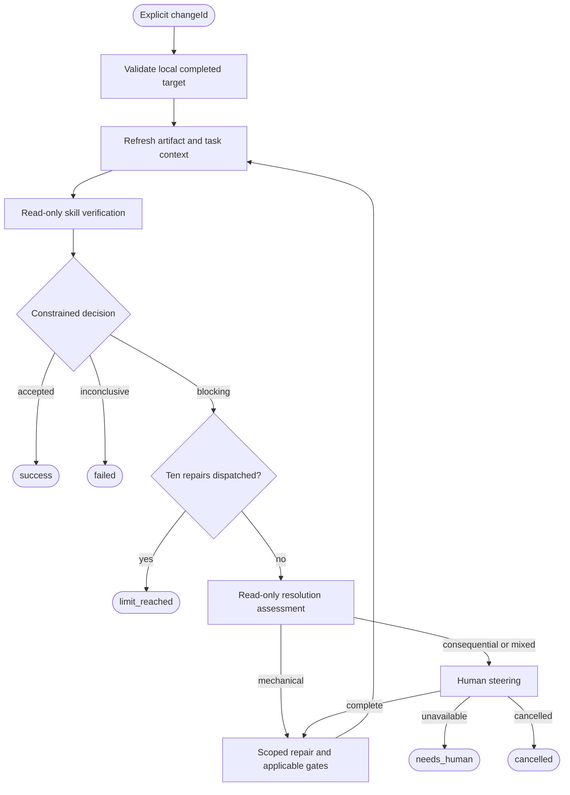

# Design

## Context

See proposal.md for motivation and specs/openspec-verify/spec.md for the behavior contract. `openspec-implement-flow` is planned but not implemented. It owns migration to per-flow directories and shared infrastructure; implementation of this proposal must wait until that change lands. Planning completion reported by OpenSpec is not proof that prerequisite code exists.

Local groom uses dependency-injected graph construction, fresh isolated Pi sessions, result guards, bounded dispatch counting, validated steering packets, and structured terminal outcomes. Its planning-artifact allowlist is not appropriate for implementation repairs.

The reference is [patextreme/ptah-libs OpenSpec playbook](https://github.com/patextreme/ptah-libs/blob/0cd1accee7d19a18f364b416eec7dd3bdf70def0/playbooks/openspec/playbook.luau), specifically `verify(change)`. That loop rejects critical findings and warnings, combines verification and repair in a work session, and syncs/archives after acceptance. Its ten-iteration cap can leave the final repair unverified. Port the convergence policy, not those session or lifecycle mechanics.

## Goals / Non-Goals

**Goals:**
- Make verification acceptance independent of implementer self-assessment and reproducible through fresh verification after repairs.
- Keep model-based classification separate from deterministic target, packet, budget, and outcome checks.
- Preserve useful report prose and concrete evidence while making routing and steering testable.
- Reuse landed infrastructure without creating a generic workflow framework.

**Non-Goals:**
- Finishing an incomplete change at entry, opportunistic suggestion cleanup, or silently changing approved intent.
- Running the entire implement flow as a nested repair loop.
- Sync/archive automation, resume machinery, rollback, dependency upgrades, or a claim of OS-enforced read-only isolation.
- Changing the verification skill's general-purpose severity or archive-readiness policy.

## Decisions

### 1. Follow the prerequisite's ownership and layout

Add `flows/openspec-verify/index.ts`, `flow.ts`, `helpers.ts`, and owning tests. `index.ts` exports the runnable flow; `flow.ts` provides a dependency-injectable factory for command execution, steering, and result emission. Reuse the landed shared command/local-target, steering, and fixture infrastructure where applicable. Verify actual interfaces after the prerequisite lands instead of prescribing exports now. Never reuse groom's artifact-edit allowlist for repairs.

The dependency is an implementation-order constraint recorded in proposal/tasks, not a guessed `.openspec.yaml` field or a requirement that downstream users possess the prerequisite's change directory. No compatibility wrapper or groom migration belongs to this change.

Alternative: implementing against today's root-level flow files would duplicate migration and force speculative shared contracts.

### 2. Preflight establishes an explicit completed local target

Use argument-safe CLI calls to resolve the selected repository and active local change. Reject missing/ambiguous selection, store-backed, archived, symlinked, escaping, or unusable targets before dispatch. Read `openspec status --change <id> --json` and `openspec instructions apply --change <id> --json` for concrete artifact context and current task state. Require a usable tasks artifact/snapshot with all tasks complete; missing tasks are not vacuous completion. Incomplete entry exits `failed` with an explicit diagnostic directing the caller to implementation.

This entry check does not prove correctness or require a previous implement-flow transcript. The verifier independently inspects implementation and establishes current applicable evidence. Refresh CLI task/artifact context on every verification cycle; if a repair leaves tasks incomplete, that becomes a blocking completeness finding, not a bypass or a repeated initial preflight rejection.

Alternative: repairing unchecked tasks on entry collapses implementation completion and independent verification into one flow.

### 3. Separate verifier, classifier, assessor, and repairer

Use fresh isolated sessions at the target cwd for every ACP and decision invocation, including graph revisits. Explicitly carry current artifacts, latest findings, and relevant accumulated steering; do not rely on session memory.

- **Verifier (ACP):** invoke `/skill:openspec-verify-change` for the explicit change, with outer instructions requiring read-only completeness/correctness/coherence checks and a usable current evidence report. Permit inspection and check execution, but no implementation or planning-artifact edits. Note justified inapplicable checks; missing required evidence is a blocking finding, not an allowed skip.
- **Classifier (decision):** choose exactly `accepted`, `blocking`, or `inconclusive` from the latest report and refreshed context. Read-only; classify the findings, not just the skill's final archive-readiness sentence.
- **Assessor (ACP):** read-only resolution planning for the current CRITICAL/WARNING findings, including missing required evidence. Produce a validated packet identifying recommendations, proposed scope, and escalation needs. This is not the decision node.
- **Repairer (ACP):** apply the assessed and authorized blocking-finding repairs, run applicable gates, and report changes, unresolved issues, and commands/results. Do not invoke the full implement flow or give it a nested budget. Every normal return routes back to fresh verification, even if the repair report claims nothing remains or reports unresolved blockers.

Alternative: a combined verify/fix session lets the verifier repair its own assessment without an independent subsequent check. A decision alone cannot safely invent resolution/authorization details.

### 4. Preserve prose with validated supporting packets

Preserve the skill's verification report and request a supporting envelope containing conclusiveness, dimensions checked/skipped with reasons, findings with unique IDs/severity/recommendation/evidence references, applicable gate commands/results, and missing required evidence. Validate types, severities, required nonblank fields, and references needed for steering. Explicitly missing required evidence must be represented as blocking (at least WARNING), even if the skill's base report omits that severity. Do not demand artifacts intentionally absent under the selected schema; distinguish justified inapplicability from a skipped required check.

The classifier sees both report and envelope. Deterministically reject an `accepted` decision inconsistent with any blocking severity, missing required evidence, unfinished current tasks, or inconclusive envelope. A malformed or unusable report/decision is `failed` without retries; a valid report identifying unavailable checks is `blocking` and proceeds to assessment. Do not turn an uninterpretable report into an invented repair problem.

Assessment packets associate each resolution with current blocking finding IDs and include a unique resolution ID, issue, recommendation, intended change scope, proposed repository paths or new paths where needed, and an escalation flag/reason. Reject empty, malformed, unrelated, or incomplete packets before routing to repair. Paths must remain repository-scoped; approval of new code/test files is not groom's existing-artifact restriction. Validate all steering data before presenting it.

Alternative: prose-only routing is vulnerable to misleading summary language. Rewriting the base skill to require zero warnings would change behavior for other callers.

### 5. Steering is explicit and scoped

Automatically repair only within approved intent. Ambiguous requirements, design changes, destructive actions, and missing external access require steering. If any issue in a batch escalates, collect answers for all escalated issues before dispatching any repairs, including mechanical ones.

Reuse shared terminal steering: stdin/stderr TTY requirements, nonblank answers, seven-day deadline, and existing unavailable/cancellation/error outcomes. Without usable interactive input, emit `needs_human`. Carry issue-associated answers into later fresh sessions without broadening them. Human guidance does not waive required evidence or approve unrelated destructive actions. Planning-artifact changes are never an automatic strategy for eliminating findings; explicitly authorized changes remain restricted to the guidance's scope and must be reverified against the resulting approved artifacts.

Alternative: upstream's narrower operator-owned decision boundary is inconsistent with the agreed local approved-design boundary.

### 6. Count repair dispatches and always reverify the final repair

Count dispatched repair steps from run state, including failed invocations. Initial verification uses no budget. Following every normally returning repair, refresh context and verify/classify before checking exhaustion. Acceptance exits immediately. Blocking findings check the budget before another assessment/steering/repair: ten dispatched repairs means `limit_reached`; no eleventh repair or needless steering occurs. A failed tenth repair is `failed`, not `limit_reached`.

Guard invocation failure, timeout, cancellation, invalid packet, and invalid classification before reading route outputs. No flow-level automatic retries. Ordinary check failures documented in a usable report are findings, not failed agent invocations. Pi/provider retry configuration remains separate.

Every executable phase also has guarded failure/timeout/cancellation exits; the diagram shows normal routing only.

Alternative: limiting verification iterations rather than repair dispatches reproduces upstream's unverified-last-repair edge case.

### 7. Explicit skill availability and terminal reporting

Document an adapter-side Pi wrapper using `--no-skills --skill <absolute-path-to-existing-openspec-verify-change/SKILL.md>` and the existing `PI_ACP_PI_COMMAND` convention. Pin the existing skill rather than copying it into the published skills directory or permitting silent same-name shadowing. Verify native skill expansion, including collision handling, in tests. Flow policy augments the skill call without renaming the skill.

Emit `changeId`, `outcome` (`success`, `limit_reached`, `needs_human`, `cancelled`, `failed`), `repairAttempts`, `summary`, and `remaining` findings/diagnostics, plus a concise stderr line. Preserve the final verification report in the result/transcript, including remaining suggestions on success. Unsuccessful routes deliberately produce a nonzero CLI exit after result emission.

No phase syncs/archives or creates an extra report file. Existing dirty edits are the starting state; no commits, stashes, or rollback. Read-only/scoped behavior is prompt-level policy, not an OS sandbox or permission grant. Adapter and Pi tool permissions must be separately configured.

Alternative: implicit skill discovery fails across workspaces; an automatic archiver changes the agreed lifecycle boundary.

## Risks / Trade-offs

- [Prerequisite interfaces are not yet code contracts] → Gate implementation on the landed migration and reuse only actual shared responsibilities.
- [Model reports omit findings or overstate evidence] → Preserve evidence/prose, validate supporting packets, cross-check acceptance, and document that verification remains model-based rather than a formal proof.
- [Base skill tolerates warnings and graceful skips] → Apply the flow's stricter policy explicitly while preserving justified inapplicability.
- [Read-only prompts or repair scopes are ignored] → Retain tool permission controls, test prompts and simulated filesystem effects, and disclaim lack of OS enforcement.
- [Fresh sessions lose steering] → Carry scoped issue-associated guidance explicitly; test multiple cycles.
- [Repairs introduce new defects] → Always freshly verify and rerun applicable gates after repairs, including the last allowed repair.
- [Tests are mistaken for live-model guarantees] → Use model-free fake-agent runner tests for control flow/session/CLI/filesystem behavior and native skill expansion tests, without claiming they prove provider obedience.

## Migration Plan

1. Land `openspec-implement-flow` first and confirm its migrated groom tests and shared infrastructure work. Do not alter that change's artifacts here.
2. Add the verifier-owned helpers, graph, unit tests, and real-runner fake-agent integration cases at the new entrypoint.
3. Document invocation, skill pinning, boundaries, outcomes, and prerequisite ownership; confirm recursive JS/Nix discovery includes the new tests.
4. Run formatting, lint, typecheck, and tests. If implementation touches package manifests or Nix configuration, also run `nix flake check`.

No existing flow path changes in this proposal. Reverting the added flow removes the feature; runtime failures never reverse user edits.
